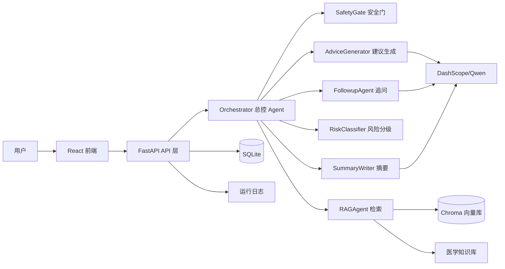
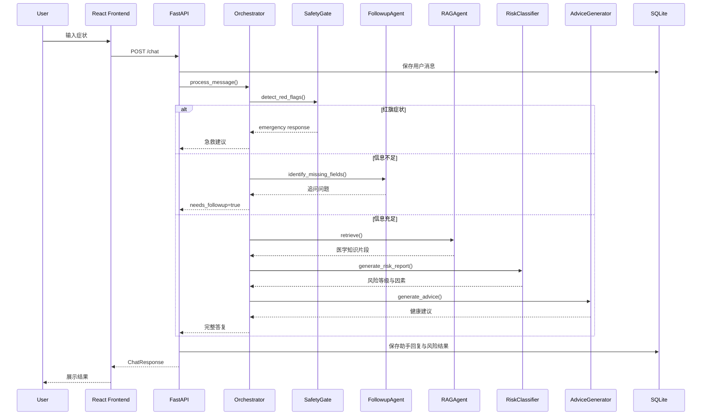

# CS599 大作业报告：Medical Triage Agent

## 封面页

| 字段 | 内容 |
| --- | --- |
| 课程名称 | 企业级应用软件设计与开发 |
| 项目名称 | Medical Triage Agent：医疗分诊与问诊智能体 |
| 方向 | 方向一：Agentic AI 原生开发 |
| 学号 | 2025302938 |
| 姓名 | 刘辰 |
| 专业 | 计算机技术 |
| 指导教师 | 戚欣 |
| 提交日期 | 2026 年 6 月 22 日 |

## 目录

1. 选题背景与设计思想
2. Specs 规格文档
3. 系统架构与设计
4. 关键实现与代码展示
5. 测试与评估
6. 系统升级与扩展
7. 课程总结

## 一、选题背景与设计思想

### 1.1 选题背景

本项目选择“医疗分诊与问诊智能体”作为方向一的 Agentic AI 原生开发项目。医疗健康咨询是一个非常典型的垂直领域场景：用户输入通常是自然语言，症状描述不完整、不标准，系统既需要理解语义，又必须处理安全边界。与普通闲聊机器人不同，医疗问诊辅助系统不能只追求回答流畅，还必须优先考虑风险识别、信息补全、可解释性和责任边界。

在日常生活中，用户遇到头痛、发热、咳嗽、腹痛、腹泻等症状时，常见做法是搜索网页或直接询问通用大模型。搜索网页会返回大量碎片化内容，用户需要自己判断哪些信息适用于当前情况；通用大模型虽然表达自然，但如果没有明确的安全门控和知识边界，可能会忽略“胸痛、呼吸困难、意识模糊、呕血”等红旗症状，甚至在应该建议急诊时继续给出居家观察建议。因此，本项目希望构建一个更符合工程化要求的医疗咨询 Agent：先判断紧急情况，再补全问诊信息，然后检索医学知识，最后给出风险分级和非诊断性质的建议。

### 1.2 问题定义

本项目解决的问题不是“让 AI 替代医生诊断”，而是“让 AI 在用户正式就医或咨询前，提供初步分诊、风险提示和信息整理”。系统的目标包括：

- 识别红旗症状，避免高风险场景被普通问答流程稀释。
- 通过多轮追问补全症状、部位、持续时间、严重程度和伴随症状。
- 使用 RAG 检索本地医学知识库，减少纯模型生成的随意性。
- 根据规则和用户信息输出 A/B/C/D 风险等级，并展示风险因素。
- 生成可理解、可操作、带有边界声明的健康建议。
- 保存对话历史、问诊结果和反馈，为复盘与评估提供数据。

### 1.3 现有方案不足

第一类方案是传统搜索引擎。它能覆盖大量医学资料，但缺少对用户上下文的理解。用户需要自己筛选信息，容易被严重疾病描述吓到，也可能因为描述过于笼统而低估风险。

第二类方案是普通聊天机器人。它的优势是对话自然，但如果没有专门的安全门控、知识检索和分诊规则，回答可能过度依赖模型内部知识。医疗场景中，单纯“看起来合理”的回答并不足够，必须能说明为什么给出某个风险等级，以及哪些情况需要立即就医。

第三类方案是纯规则分诊系统。它可解释、稳定，但交互体验较差，对用户自然语言表达的适应能力有限。例如用户说“胸口像被压着，喘不上来”，纯关键词系统可能漏掉“胸痛/呼吸困难”的风险信号。

因此，本项目采用混合式 Agent 架构：安全和风险分级使用规则增强可控性，追问和建议生成使用 LLM 增强自然语言能力，医学知识通过 RAG 引入外部知识来源。

### 1.4 设计思想

本项目的核心设计思想是“安全优先、分步决策、模块解耦、可评估”。安全优先指系统必须先判断是否存在紧急症状；只要命中红旗症状，就不再进入普通建议生成流程，而是返回急救建议。分步决策指 Agent 不直接从用户输入生成最终答案，而是经过 SafetyGate、FollowupAgent、RAGAgent、RiskClassifier、AdviceGenerator 等步骤。模块解耦指每个 Agent 都是独立类和独立职责，便于单元测试和未来替换为 LangGraph Node 或 MCP Tool。可评估指系统输出不仅包含自然语言建议，还包含风险等级、风险分数、风险因素和日志记录，便于后续做行为评估。

### 1.5 技术路线

系统采用前后端分离结构。前端使用 React、TypeScript、Vite 和 Tailwind CSS，实现聊天界面、用户信息表单、风险提示和反馈提交。后端使用 FastAPI 提供 REST API，使用 SQLAlchemy 和 SQLite 保存用户会话、问诊消息、风险结果和反馈。Agent 层使用 Python 实现多个专职 Agent，由 Orchestrator 统一编排。RAG 层使用 LangChain、Chroma 和 DashScope Embeddings，对 `src/app/rag/medical_docs/` 下的医学知识文档进行切分、向量化和检索。LLM 使用 DashScope 兼容 OpenAI 接口的 Qwen 模型，通过环境变量读取 API Key，避免硬编码密钥。

本项目覆盖课程要求中的多个核心技术要素：SDD 规格驱动开发、函数化工具调用、RAG 增强问答、对话记忆、多步骤推理、多 Agent 协作、日志可观测性和测试评估。

## 二、Specs 规格文档

本项目采用 SDD（Specification Driven Development，规格驱动开发）组织需求、架构和接口。完整规格文档位于 `docs/specs.md`，这里给出核心内容摘要。

### 2.1 Product Spec

#### 产品定位

Medical Triage Agent 是一个医疗分诊与问诊辅助系统。它不提供确定诊断，不开具处方药，不替代医生，而是在用户输入症状后，辅助完成初步信息收集、风险判断和就医建议生成。

#### 目标用户

| 用户类型 | 典型需求 | 系统价值 |
| --- | --- | --- |
| 普通用户 | 想知道症状是否严重、是否需要就医 | 获得初步风险提示和就医优先级 |
| 医疗平台 | 希望正式问诊前收集结构化信息 | 降低医生初诊信息采集成本 |
| 课程评审者 | 希望看到 Agentic AI 工程闭环 | 展示规格、架构、实现、测试和评估 |

#### 功能需求

| 编号 | 需求 | 优先级 | 验收标准 |
| --- | --- | --- | --- |
| P1 | 红旗症状识别 | Must | 输入“胸痛、呼吸困难、意识模糊”等症状时，系统直接输出急救建议 |
| P2 | 多轮追问 | Must | 用户描述不完整时，系统追问部位、持续时间、严重程度、伴随症状等字段 |
| P3 | 医学知识检索 | Must | 系统从本地医学知识库检索相关片段，并作为建议生成上下文 |
| P4 | 风险分级 | Must | 系统输出 A/B/C/D 风险等级、分数和风险因素 |
| P5 | 建议生成 | Must | 系统生成包含初步分析、就医建议、注意事项和观察指标的建议 |
| P6 | 对话记忆 | Should | 系统保存会话、消息、风险结果和反馈 |
| P7 | 前端交互 | Should | 用户可通过网页完成问诊、查看回复并提交反馈 |
| P8 | 可观测性 | Should | 系统记录关键日志，便于复盘 Agent 决策 |

#### 非功能需求

| 类型 | 要求 |
| --- | --- |
| 安全性 | API Key 只能通过 `.env` 配置，不能进入 GitHub 仓库 |
| 可解释性 | 风险输出必须包含风险因素，避免只给结论 |
| 可维护性 | Agent 模块独立，避免把所有逻辑堆在一个 Prompt 中 |
| 可扩展性 | 未来可接入 LangGraph、MCP、Docker 和云端部署 |
| 可测试性 | 核心规则和 Agent 行为应能通过自动化测试验证 |

### 2.2 Architecture Spec

系统采用“前端交互层 - API 层 - Agent 编排层 - 知识与存储层”的分层架构。每层职责如下：

| 层级 | 模块 | 职责 |
| --- | --- | --- |
| 前端交互层 | React UI | 展示聊天消息、用户信息表单、风险提示和反馈入口 |
| API 层 | FastAPI Router | 接收请求、校验参数、调用 Orchestrator、保存结果 |
| Agent 编排层 | Orchestrator | 控制安全检测、追问、RAG、风险分级和建议生成的执行顺序 |
| 专职 Agent 层 | SafetyGate、FollowupAgent、RAGAgent 等 | 承担单一职责，提供可测试的函数化能力 |
| 知识层 | Markdown 医学知识库 + Chroma | 提供常见症状和红旗症状相关知识 |
| 存储层 | SQLite | 保存用户、问诊、消息和反馈 |

#### Agent 职责划分

| Agent | 文件 | 输入 | 输出 |
| --- | --- | --- | --- |
| SafetyGate | `src/app/agents/safety_gate.py` | 用户自然语言消息 | 是否命中红旗症状、紧急建议 |
| FollowupAgent | `src/app/agents/followup_agent.py` | 对话历史 | 缺失字段、追问问题 |
| RAGAgent | `src/app/agents/rag_agent.py` | 当前问题 | 医学知识片段 |
| RiskClassifier | `src/app/agents/risk_classifier.py` | 症状、年龄、病史、体温等 | 风险等级、分数、因素 |
| AdviceGenerator | `src/app/agents/advice_generator.py` | 用户信息、RAG 上下文、风险等级 | 综合建议 |
| SummaryWriter | `src/app/agents/summary_writer.py` | 问诊记录 | 问诊摘要 |
| Orchestrator | `src/app/agents/orchestrator.py` | 消息、用户信息、问诊 ID | 最终响应和状态 |

### 2.3 API Spec

系统核心 API 如下：

| 接口 | 方法 | 请求内容 | 返回内容 | 用途 |
| --- | --- | --- | --- | --- |
| `/chat/` | POST | `session_id`、`message`、`user_info` | 回复、问诊 ID、是否完成、是否追问 | 多轮问诊主入口 |
| `/chat/history/{session_id}` | GET | 会话 ID | 历史消息列表 | 恢复对话记忆 |
| `/triage/risk` | POST | 症状、年龄、病史、体温 | 风险等级、分数、因素 | 独立风险评估 |
| `/triage/red-flags` | POST | 用户消息 | 红旗症状检测结果 | 安全检测 |
| `/summary/{consultation_id}` | GET | 问诊 ID | 摘要和原始数据 | 复盘问诊 |
| `/feedback/` | POST | 问诊 ID、评分、评论 | 反馈提交结果 | 收集用户评价 |

`/chat/` 的请求示例：

```json
{
  "session_id": "session_001",
  "message": "我头痛已经两天了，有点恶心",
  "user_info": {
    "age": 30,
    "gender": "男",
    "medical_history": "无",
    "medication": "无",
    "allergies": "无"
  }
}
```

`/chat/` 的响应示例：

```json
{
  "response": "风险评估与健康建议文本",
  "consultation_id": 1,
  "is_complete": true,
  "needs_followup": false,
  "followup_question": null
}
```

### 2.4 SDD 到实现的映射

| 规格项 | 实现位置 | 测试或验证方式 |
| --- | --- | --- |
| 红旗症状识别 | `SafetyGate.detect_red_flags` | `tests/test_safety_gate.py` |
| 风险分级 | `RiskClassifier.assess_risk` | `tests/test_risk_classifier.py` |
| 多轮追问 | `FollowupAgent.identify_missing_fields` | `tests/test_followup.py` |
| RAG 检索 | `RAGAgent.retrieve` | 运行问诊流程和日志验证 |
| 对话持久化 | `app/database/models.py` 与 CRUD | API 联调 |
| 前端交互 | `src/App.tsx` | `npm run build` |

## 三、系统架构与设计

### 3.1 总体架构



该架构的关键点是 Orchestrator 只负责编排，不承担具体医学规则和生成逻辑。SafetyGate、FollowupAgent、RAGAgent、RiskClassifier 和 AdviceGenerator 都可以单独运行和测试。这种设计使系统更接近企业级应用中的“可维护服务”，而不是一次性 Prompt Demo。

### 3.2 Agent 交互流程



### 3.3 数据流设计

用户输入首先经过 Pydantic Schema 校验，避免空消息或过长消息进入后端。API 层根据 `session_id` 获取或创建用户，并将用户年龄、性别、病史、用药、过敏等信息合并到当前上下文中。随后 Orchestrator 根据当前消息和历史消息进行多步骤推理。最终响应会写回数据库，风险等级和建议也会更新到对应问诊记录。

数据流可拆成三类：

| 数据类型 | 来源 | 存储位置 | 用途 |
| --- | --- | --- | --- |
| 会话数据 | 前端 localStorage 生成 `session_id` | SQLite `users`、`consultations`、`messages` | 对话记忆和历史恢复 |
| 医学知识 | `src/app/rag/medical_docs/*.md` | Chroma 向量库 | RAG 检索上下文 |
| 运行日志 | API 和 Agent 执行过程 | `logs/medical_agent.log` | 可观测性和评估复盘 |

### 3.4 风险等级设计

风险等级采用 A/B/C/D 四级：

| 等级 | 名称 | 分数范围 | 建议 |
| --- | --- | --- | --- |
| A | 急诊 | `score >= 70` 或强红旗症状 | 立即前往急诊或拨打 120 |
| B | 尽快就医 | `50 <= score < 70` | 建议 24 小时内就医 |
| C | 门诊 | `30 <= score < 50` | 建议 1-3 天内门诊 |
| D | 居家观察 | `score < 30` | 居家观察，症状加重及时就医 |

风险分数由症状、年龄、基础病、特殊人群和体温共同影响。例如胸痛和呼吸困难属于高权重症状；老年人、儿童、孕妇、免疫低下者会增加风险；糖尿病、高血压、心脏病等病史也会提高分数。相比直接让 LLM 判断风险等级，规则分级更稳定，也更容易解释。

### 3.5 安全边界设计

医疗系统最重要的不是让回答“像医生”，而是避免危险建议。本项目设置了三层边界：

1. 安全门控：红旗症状优先处理。
2. 非诊断声明：所有建议都强调不能替代医生诊断。
3. 高风险升级：风险等级较高时，建议优先就医而不是自行处理。

## 四、关键实现与代码展示

### 4.1 Orchestrator 核心循环

核心文件为 `src/app/agents/orchestrator.py`。Orchestrator 的职责是决定下一步调用哪个 Agent，而不是亲自完成所有任务。

```python
has_red_flags, detected_flags = self.safety_gate.detect_red_flags(message)

if has_red_flags:
    return {
        "response": self.safety_gate.get_emergency_response(detected_flags),
        "is_emergency": True,
        "detected_flags": detected_flags,
        "is_complete": True,
        "needs_followup": False
    }
```

这段代码体现了“安全优先”的设计。只要 SafetyGate 判断存在红旗症状，流程直接返回急救建议，不再调用 RAG 和 AdviceGenerator。这可以避免模型在紧急场景中生成普通健康建议。

```python
missing_fields = self.followup_agent.identify_missing_fields(conversation_context)

if missing_fields:
    followup_question = self.followup_agent.generate_followup_question(
        missing_fields,
        "\n".join([msg.get("content", "") for msg in conversation_context])
    )
    return {
        "response": followup_question,
        "is_emergency": False,
        "is_complete": False,
        "needs_followup": True,
        "missing_fields": missing_fields
    }
```

这段代码对应多轮问诊能力。医疗问诊并不是用户输入一句话就能完成，系统需要主动追问关键信息。FollowupAgent 会检查症状、部位、持续时间、严重程度和伴随症状是否完整，再决定是否进入最终建议生成。

```python
rag_context = self.rag_agent.retrieve(message)
user_info["symptoms"] = message
risk_report = self.risk_classifier.generate_risk_report(user_info)
advice = self.advice_generator.generate_advice(
    user_info,
    rag_context,
    risk_report["risk_level"]
)
```

当信息足够时，系统先检索医学知识，再进行风险分级，最后生成建议。这个顺序保证 AdviceGenerator 的输入不只是用户原文，还包括结构化风险等级和知识库片段。

### 4.2 SafetyGate 安全门

SafetyGate 位于 `src/app/agents/safety_gate.py`。它维护红旗症状列表，如胸痛、胸闷、呼吸困难、意识模糊、剧烈头痛、呕血、黑便、高热、抽搐、大量出血等。检测方式是关键词匹配，优点是速度快、行为稳定、易于测试。虽然关键词方式不能覆盖所有医学表达，但作为第一道安全防线，它能有效处理最常见的高风险信号。

命中红旗症状后，系统返回包含“立即拨打 120、保持患者平躺、不要给意识不清患者喂食喂水”等内容的急救建议。这个设计遵循保守原则：宁可在高风险输入下建议就医，也不冒险给出居家处理意见。

### 4.3 FollowupAgent 追问策略

FollowupAgent 位于 `src/app/agents/followup_agent.py`。它的目标是让问诊信息达到最小可用完整度。系统设置五个关键字段：症状、部位、持续时间、严重程度、伴随症状。为了避免机械地只判断字段名是否出现，代码中加入了关键词映射。例如“头痛已经 2 天了”可以被识别为包含症状、部位和持续时间；“轻微咳嗽”可以被识别为包含症状和严重程度。

当缺失字段较多时，FollowupAgent 会调用 LLM 生成自然追问。Prompt 要求一次只问 1-2 个最重要问题，语气温和，问题具体且易回答。这样既能补全信息，又不会让用户一次面对过多问题。

### 4.4 RAGAgent 医学知识检索

RAGAgent 位于 `src/app/agents/rag_agent.py`。它读取 `src/app/rag/medical_docs/` 下的 Markdown 医学知识文档，包括发热、咳嗽、头痛、腹痛、腹泻、红旗症状等内容。系统使用 DashScope Embeddings 将文档切分并写入 Chroma 向量库，问诊时调用相似度检索获得相关片段。

RAG 的价值在于把建议生成限制在项目维护的知识范围内，减少模型完全自由发挥。对于课程项目而言，本地医学知识库虽然规模不大，但已经展示了企业知识库 + Agentic RAG 的基本链路：知识整理、向量索引、语义检索、上下文注入和建议生成。

### 4.5 RiskClassifier 风险分级

RiskClassifier 位于 `src/app/agents/risk_classifier.py`。它根据症状关键词、体温、年龄、病史和特殊人群信息计算风险分数。示例规则包括：

- 呼吸困难：增加 40 分。
- 胸痛：增加 40 分。
- 意识模糊：增加 50 分。
- 高热大于 39°C：增加 30 分。
- 年龄大于等于 65 岁：分数乘以 1.3。
- 年龄小于等于 12 岁：分数乘以 1.5。
- 糖尿病、高血压、心脏病等病史分别增加风险。
- 孕妇和免疫低下者增加风险权重。

该模块的输出不仅有风险等级，还有风险因素列表。例如用户输入“胸痛，呼吸困难，有高血压史”时，系统会输出“胸痛、呼吸困难、高血压史”等因素。这种可解释输出比单纯回答“高风险”更适合评估和复盘。

### 4.6 AdviceGenerator 建议生成

AdviceGenerator 位于 `src/app/agents/advice_generator.py`。它使用 ChatPromptTemplate 构造 Prompt，输入包括年龄、症状、病史、用药情况、医学知识库参考和风险等级。输出要求包含初步分析、就医建议、注意事项、观察指标等内容，并明确提醒用户最终需咨询专业医生。

这里的 LLM 不是独立决策者，而是“表达与整合层”。真正的安全门、风险分级和知识检索在前置模块中完成。这样可以降低 LLM 幻觉对系统核心决策的影响。

### 4.7 数据库与记忆机制

数据库模型位于 `src/app/database/models.py`，包括 User、Consultation、Message 和 Feedback 四类表。User 通过 `session_id` 标识用户；Consultation 保存问诊状态、风险等级、主诉和建议；Message 保存多轮对话；Feedback 保存用户评分和评论。

这种设计实现了基础对话记忆：同一用户再次访问时，前端使用 localStorage 保存的 `session_id` 恢复历史消息，后端从数据库读取对应问诊记录。虽然这不是长期语义记忆，但已经具备跨请求状态管理能力。

### 4.8 前端实现

前端核心文件为 `src/App.tsx` 和 `src/services/api.ts`。前端提供用户信息表单、聊天消息列表、发送输入框、新对话按钮、风险提示条和反馈组件。`src/services/api.ts` 封装了 `/chat/`、`/chat/history/`、`/feedback/`、`/triage/risk`、`/summary/` 等 API 调用。

前端设计目标不是做营销页面，而是让用户直接进入问诊流程。界面围绕对话展开，降低用户使用门槛，同时通过风险提示条突出高风险输出。

## 五、测试与评估

### 5.1 自动化测试

项目测试位于 `tests/` 目录，使用 Pytest。当前测试覆盖 SafetyGate、RiskClassifier 和 FollowupAgent 三个关键模块，共 15 个测试用例。测试结果为：

```plain
15 passed
```

测试覆盖情况如下：

| 测试文件 | 覆盖模块 | 核心验证点 |
| --- | --- | --- |
| `tests/test_safety_gate.py` | SafetyGate | 胸痛、胸闷、呼吸困难、晕厥、意识模糊等红旗症状识别 |
| `tests/test_risk_classifier.py` | RiskClassifier | 低风险、高风险、老年人、糖尿病、孕妇和风险报告生成 |
| `tests/test_followup.py` | FollowupAgent | 缺失字段识别和追问生成 |

### 5.2 功能测试场景

| 场景 | 输入 | 预期行为 | 评估重点 |
| --- | --- | --- | --- |
| 急症识别 | “我胸痛胸闷，呼吸困难” | 返回紧急情况识别和 120 建议 | 安全门是否优先 |
| 信息不足 | “我不舒服” | 追问症状部位、持续时间等 | 多轮问诊是否有效 |
| 普通症状 | “轻微咳嗽，有一点痰” | 输出较低风险和观察建议 | 不过度升级 |
| 高危人群 | “70 岁老人发热，有糖尿病史” | 风险分数高于普通成年人 | 年龄和病史是否生效 |
| 消化道风险 | “腹痛，黑便” | 识别消化道出血风险 | 红旗症状召回 |

### 5.3 Agent 行为评估

Agent 行为评估不仅看最终回答是否通顺，还看流程是否符合设计。评估维度如下：

| 维度 | 指标 | 说明 |
| --- | --- | --- |
| 安全性 | 红旗症状召回 | 高风险输入是否被 SafetyGate 捕获 |
| 完整性 | 追问字段覆盖 | 信息不足时是否补问关键字段 |
| 解释性 | 风险因素输出 | 风险等级是否有因素支撑 |
| 一致性 | 同类输入输出稳定性 | 类似症状是否给出相近等级 |
| 边界性 | 非诊断声明 | 是否明确不能替代医生诊断 |
| 可用性 | 前端交互闭环 | 用户是否能完成输入、查看回复、提交反馈 |

### 5.4 与课程要求的对应关系

| 课程技术要素 | 本项目体现 |
| --- | --- |
| SDD 规格驱动开发 | `docs/specs.md` 和报告第二章 |
| 工具使用 / Function Calling | 各 Agent 以函数化模块方式被 Orchestrator 调用 |
| 记忆机制 | SQLite 保存用户、问诊、消息和反馈 |
| 状态管理与多步骤推理 | Orchestrator 控制安全检测、追问、RAG、分级和建议生成 |
| 多智能体协作 | SafetyGate、FollowupAgent、RAGAgent、RiskClassifier、AdviceGenerator、SummaryWriter |
| 可观测性与评估 | 日志记录、Pytest、行为评估表 |
| Agentic RAG | LangChain + Chroma + DashScope Embeddings |

### 5.5 已知不足

第一，红旗症状识别目前主要依赖关键词，无法完全覆盖口语化表达。第二，风险分级规则由人工设计，仍需结合更多医学指南和真实样本校准。第三，RAG 知识库规模较小，只覆盖常见症状，尚未达到生产级医疗知识库水平。第四，当前没有云服务器部署 URL，Demo 需要依赖本地环境。第五，报告中的测试以单元测试和场景评估为主，还没有建立大规模 Benchmark。

这些不足也为后续扩展提供了方向：引入医学安全评测集、扩大知识库、增加语义红旗症状识别、接入 LangGraph 状态机和 MCP 工具协议。

## 六、系统升级与扩展

### 6.1 LangGraph 状态机升级

当前 Orchestrator 使用手写流程控制，结构清晰但状态可视化能力有限。下一阶段可以使用 LangGraph 将 SafetyGate、FollowupAgent、RAGAgent、RiskClassifier、AdviceGenerator 封装成节点，并显式定义状态转移边。这样可以获得更好的中断恢复、状态检查和可视化调试能力。

### 6.2 MCP 工具化

SafetyGate、RiskClassifier 和 RAGAgent 都适合封装为 MCP Tool。封装后，其他 Agent 或 IDE 可以通过统一协议调用这些能力。例如：

- `detect_red_flags(message)`：返回红旗症状。
- `assess_risk(user_info)`：返回风险等级和因素。
- `retrieve_medical_docs(query)`：返回相关医学知识。

MCP 化后，系统不再局限于当前 Web 应用，也可以作为其他医疗问答、客服或教务项目中的工具组件。

### 6.3 知识库扩展

当前知识库使用 Markdown 文件维护，适合课程项目。未来可以扩展为：

- 接入更完整的医学指南和公开健康知识。
- 为每条知识增加来源、更新时间、适用人群和风险等级标签。
- 建立知识审核流程，避免错误医学内容进入 RAG。
- 引入混合检索，同时使用关键词检索和向量检索。

### 6.4 评估体系升级

生产级 Agent 不能只靠人工体验判断效果。后续可以构建 Benchmark：

| 评估集 | 内容 | 指标 |
| --- | --- | --- |
| 红旗症状集 | 胸痛、呼吸困难、意识障碍等 | 召回率、误报率 |
| 常见症状集 | 发热、咳嗽、头痛、腹痛等 | 风险等级一致性 |
| 追问集 | 不完整症状描述 | 追问字段覆盖率 |
| 安全边界集 | 要求诊断、开药、忽略急症等 | 拒答与升级建议准确率 |

### 6.5 部署与工程化

后续工程化方向包括：

1. 增加 Dockerfile 和 Docker Compose，一键启动前端、后端和向量库。
2. 增加 CI 流水线，在 GitHub Actions 中运行 Pytest 和前端构建。
3. 增加 `.env.example` 的详细说明，降低部署门槛。
4. 增加接口限流、输入审计和异常告警。
5. 部署到云服务器，提供稳定 Demo URL。

## 七、课程总结

通过本项目，我对“AI 驱动的软件开发与 Agentic AI”有了更具体的理解。最初我容易把 AI 应用理解为“写一个 Prompt，然后调用一次大模型”。但在医疗问诊场景中，这种方式明显不够。一个真正可用的 Agent 系统需要把任务拆成多个步骤：先做安全判断，再收集上下文，再检索知识，再进行风险判断，最后才是自然语言表达。

在开发过程中，我体会到 SDD 的价值。先写 Product Spec、Architecture Spec 和 API Spec，可以避免实现时不断偏离目标。比如“红旗症状优先”这个规则如果只写在 Prompt 里，很容易被后续回答逻辑覆盖；但当它被写入架构和代码流程后，就成为系统的硬约束。类似地，风险分级、追问字段、数据库模型和 API 响应格式都通过规格文档提前固定，后续实现更顺畅。

我也认识到 Agentic AI 的关键不只是“模型更强”，而是“编排更可靠”。LLM 擅长语言理解和表达，但不适合独自承担所有决策。把 LLM 放在合适的位置，让规则、检索、数据库、日志和测试共同约束系统，才能让项目更像企业级应用，而不是一次性演示。

本项目还让我对工程边界有了更深感受。医疗场景具有高风险，系统必须明确自己不能替代医生诊断。即使是课程项目，也需要在 README、Prompt 和最终回复中反复声明边界。未来如果继续完善，我希望重点提升医学安全评估、知识库质量、LangGraph 状态机和 MCP 工具化能力，让这个项目从课程大作业进一步演进为可复用的垂直领域 Agent 框架。

总体而言，本项目完成了从需求规格、架构设计、代码实现、测试验证到文档交付的完整闭环，也体现了我从“代码编写者”向“智能体编排者”的思维转变。
