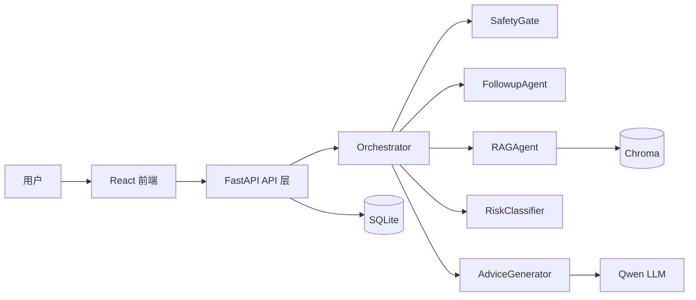

# CS599 大作业报告：Medical Triage Agent

## 封面页

| 字段 | 内容 |
| --- | --- |
| 课程名称 | 企业级应用软件设计与开发 |
| 项目名称 | Medical Triage Agent：医疗分诊与问诊智能体 |
| 方向 | 方向一：Agentic AI 原生开发 |
| 学号 | TODO-请填写学号 |
| 姓名 | TODO-请填写姓名 |
| 专业 | TODO-请填写计算机技术或软件工程 |
| 指导教师 | 戚欣 |
| 提交日期 | 2026 年 6 月 22 日 |

## 目录

1. 选题背景与设计思想
2. Specs 规格文档
3. 系统架构与设计
4. 关键实现与代码展示
5. 测试与评估
6. 系统升级与扩展
7. 课程总结

## 一、选题背景与设计思想

### 1.1 问题定义

普通用户在出现头痛、发热、腹痛、咳嗽等常见症状时，往往难以判断是否需要立即就医。搜索引擎给出的答案碎片化、风险提示不足，普通聊天机器人又容易忽略红旗症状。本项目构建一个医疗分诊与问诊智能体，在非诊断边界下帮助用户完成初步信息收集、风险提示和就医建议。

### 1.2 现有方案不足

- 搜索式问答缺少连续追问，无法形成完整病情上下文。
- 普通 LLM 问答缺少安全门控，可能在紧急症状下继续生成普通建议。
- 纯规则分诊可解释但表达僵硬，难以生成用户可理解的建议。
- 单次问答无法沉淀问诊记录，不利于复盘和评估。

### 1.3 项目价值

Medical Triage Agent 将规则、RAG、LLM 和状态化对话结合起来：先保障安全，再追问补全，随后检索医学知识并进行风险分级，最后生成可读建议。系统适合课程场景展示 Agentic AI 从规格、架构、实现到评估的闭环。

### 1.4 技术路线

本项目采用 FastAPI + React 的 Web 架构，后端通过 Orchestrator 编排多个专职 Agent。医学知识使用 Markdown 文档维护，并通过 Chroma 向量库检索。LLM 使用 DashScope 兼容 OpenAI 接口的 Qwen 模型。数据库使用 SQLite 保存会话、消息和反馈。

## 二、Specs 规格文档

完整规格见 `docs/specs.md`。核心 SDD 规格包括 Product Spec、Architecture Spec 和 API Spec。

### 2.1 Product Spec 摘要

系统目标是为用户提供常见症状的初步风险提示。必须满足红旗症状识别、多轮追问、RAG 检索、风险分级、健康建议生成和对话持久化。

### 2.2 Architecture Spec 摘要

系统被拆分为 SafetyGate、FollowupAgent、RAGAgent、RiskClassifier、AdviceGenerator、SummaryWriter 和 Orchestrator。Orchestrator 负责控制状态流转，避免各 Agent 直接耦合。

### 2.3 API Spec 摘要

核心接口为 `/chat/`，承担多轮问诊主流程；`/triage/risk` 用于独立风险评估；`/triage/red-flags` 用于红旗症状检测；`/summary/{consultation_id}` 用于问诊摘要；`/feedback/` 用于用户反馈。

## 三、系统架构与设计

### 3.1 核心架构图



### 3.2 Agent 交互流程

1. 用户输入症状。
2. SafetyGate 检查红旗症状；若命中，立即返回急救建议。
3. FollowupAgent 检查症状、部位、持续时间、严重程度和伴随症状是否完整。
4. RAGAgent 从医学知识库检索相关片段。
5. RiskClassifier 生成 A/B/C/D 风险等级与风险因素。
6. AdviceGenerator 基于用户信息、风险等级和 RAG 上下文生成建议。
7. API 层保存对话、风险结果和反馈。

### 3.3 数据流设计

自然语言输入经过 Pydantic 校验后进入会话上下文；Agent 输出结果写入 SQLite；医学知识文档被切分并写入 Chroma；日志记录每次问诊的关键状态。

## 四、关键实现与代码展示

### 4.1 Agent 核心循环

核心文件：`src/app/agents/orchestrator.py`。

```python
has_red_flags, detected_flags = self.safety_gate.detect_red_flags(message)
if has_red_flags:
    return {
        "response": self.safety_gate.get_emergency_response(detected_flags),
        "is_emergency": True,
        "is_complete": True,
    }

missing_fields = self.followup_agent.identify_missing_fields(conversation_context)
if missing_fields:
    followup_question = self.followup_agent.generate_followup_question(missing_fields)
    return {
        "response": followup_question,
        "needs_followup": True,
        "is_complete": False,
    }

rag_context = self.rag_agent.retrieve(message)
risk_report = self.risk_classifier.generate_risk_report(user_info)
advice = self.advice_generator.generate_advice(user_info, rag_context, risk_report["risk_level"])
```

### 4.2 工具与模块化调用

项目未把能力写成一个大 Prompt，而是将每个 Agent 设计为可函数化调用的模块。`SafetyGate.detect_red_flags()`、`RAGAgent.retrieve()`、`RiskClassifier.generate_risk_report()` 都可以单独测试，也可以作为未来 MCP Tool 或 LangGraph Node 接入。

### 4.3 配置文件

配置集中在 `src/app/utils/config.py`，API Key 通过 `.env` 注入，不硬编码。`.gitignore` 已排除 `.env`、日志、数据库、向量库和 `node_modules`。

### 4.4 AI IDE 使用

本项目开发过程使用 AI IDE 辅助完成代码审查、规格文档整理、测试用例补齐和交付结构检查。最终代码仍通过本地测试和人工审阅保证一致性。

## 五、测试与评估

### 5.1 功能测试

测试目录为 `tests/`，覆盖 SafetyGate、RiskClassifier 和 FollowupAgent。典型测试包括：

- 输入“胸痛和胸闷”应识别红旗症状。
- 输入“轻微咳嗽”不应触发紧急响应。
- 高龄、孕妇、糖尿病史等因素应提高风险分。
- 对“我头痛已经2天了”应识别已有症状、部位和持续时间。

### 5.2 Agent 行为评估

| 场景 | 输入 | 预期 |
| --- | --- | --- |
| 急症识别 | 胸痛、呼吸困难 | 立即输出 120 和急诊建议 |
| 信息不足 | 我不舒服 | 追问关键病情信息 |
| 普通咨询 | 轻微咳嗽、有痰 | 输出低风险和观察建议 |
| 高危人群 | 老年人发热、有基础病 | 风险等级上调 |

### 5.3 可观测性

系统运行时会生成 `logs/medical_agent.log`，记录咨询 ID、红旗症状、缺失字段、风险等级等关键事件。该目录属于本地运行产物，不提交到仓库；评估时可结合日志回放 Agent 决策链路。

## 六、系统升级与扩展

1. 将 Orchestrator 升级为 LangGraph 状态机，显式管理节点、边和中断恢复。
2. 将 SafetyGate、RAGAgent、RiskClassifier 封装为 MCP Tool，支持被其他 Agent 复用。
3. 引入更严格的医学安全评测集，对红旗症状召回率和误报率进行量化。
4. 增加 Docker Compose，一键启动 API、前端和向量库。
5. 增加 Demo 视频和云服务器部署 URL，提升最终展示稳定性。

## 七、课程总结

通过本项目，我从“调用一次大模型生成答案”的思路，转向“设计一个可控、可评估、可扩展的智能体系统”。在医疗场景中，Agent 首先要处理安全边界，再考虑回答质量。SDD 方法帮助我把产品目标、架构、API 和测试对齐，使实现过程更接近工程闭环。后续我希望继续加强 LangGraph、MCP 和可观测评估能力，让系统从课程 Demo 进一步走向可复用的垂直领域 Agent 框架。
