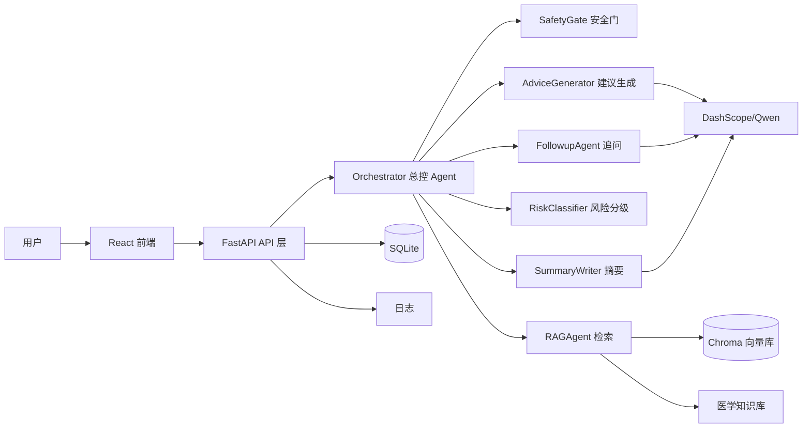
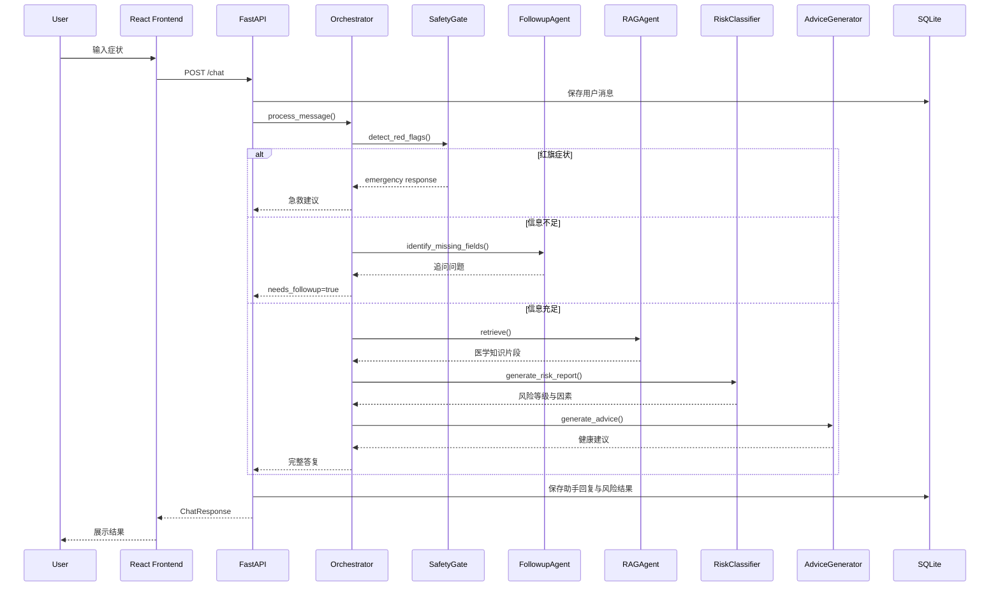
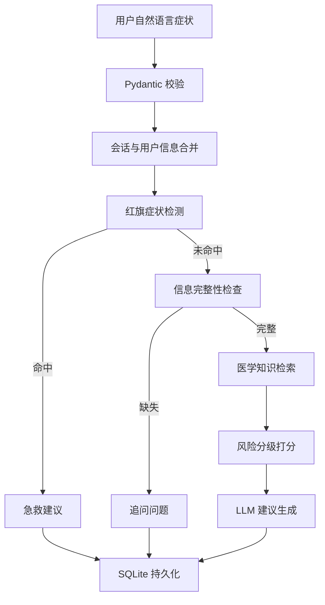

# 系统架构说明

## 总体架构

## Agent 交互流程

## 数据流设计

## 风险等级策略

| 等级 | 名称 | 触发条件 | 输出策略 |
| --- | --- | --- | --- |
| A | 急诊 | 分数 >= 70 或红旗症状 | 立即拨打 120 或急诊 |
| B | 尽快就医 | 分数 >= 50 | 24 小时内就医 |
| C | 门诊 | 分数 >= 30 | 1-3 天内门诊 |
| D | 居家观察 | 分数 < 30 | 居家观察，症状加重就医 |

## 工程边界

系统定位为“健康咨询与就医分诊辅助”，不是诊断系统。所有生成建议必须包含“不能替代医生诊断”的边界声明；红旗症状命中时不继续生成普通建议，而是优先返回急救建议。
