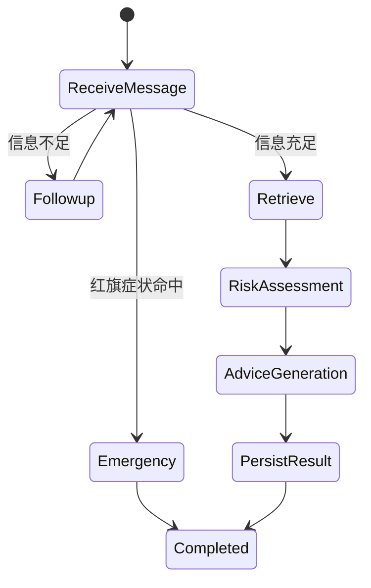

# Specs 规格文档

## 1. Product Spec

### 1.1 产品定位

Medical Triage Agent 是一个医疗问诊辅助智能体，用于帮助用户在描述常见症状后获得初步风险提示、就医建议和问诊摘要。系统不提供诊断结论，不替代医生，而是帮助用户判断是否需要急诊、尽快就医、门诊观察或居家观察。

### 1.2 目标用户

- 普通用户：希望快速了解症状风险和就医优先级。
- 医疗服务平台：希望在正式问诊前收集结构化病情信息。
- 课程评审者：验证 Agentic AI 在垂直场景中的完整工程闭环。

### 1.3 核心需求

| 编号 | 需求 | 优先级 | 验收标准 |
| --- | --- | --- | --- |
| P1 | 识别红旗症状 | Must | 输入胸痛、呼吸困难等症状时，系统直接输出急救建议 |
| P2 | 多轮追问补全信息 | Must | 症状信息不足时，系统追问部位、时长、严重程度等信息 |
| P3 | RAG 检索医学知识 | Must | Agent 能从本地医学文档检索相关知识片段 |
| P4 | 输出风险等级 | Must | 根据规则输出 A/B/C/D 风险等级、分数和风险因素 |
| P5 | 生成健康建议 | Must | 基于风险等级与 RAG 上下文生成非诊断性建议 |
| P6 | 保存对话与反馈 | Should | SQLite 持久化会话、消息、风险等级和评分 |
| P7 | 提供可视化前端 | Should | 用户可以通过网页进行多轮对话 |

### 1.4 非功能需求

- 安全性：API Key 必须通过环境变量配置，不进入 Git 仓库。
- 可解释性：风险等级必须包含风险因素列表。
- 可观测性：关键流程写入日志，便于复盘 Agent 行为。
- 可扩展性：Agent 模块独立，后续可替换为 LangGraph 状态机或 MCP 工具。

## 2. Architecture Spec

### 2.1 Agent 分工

| Agent | 职责 | 输入 | 输出 |
| --- | --- | --- | --- |
| Orchestrator | 总控编排 | 用户消息、用户信息、问诊 ID | 统一响应 |
| SafetyGate | 紧急安全门 | 用户消息 | 红旗症状、急救建议 |
| FollowupAgent | 信息补全 | 对话历史 | 缺失字段、追问问题 |
| RAGAgent | 医学知识检索 | 用户问题 | 相关医学知识片段 |
| RiskClassifier | 风险分级 | 症状、年龄、病史、体温 | 风险等级、分数、因素 |
| AdviceGenerator | 建议生成 | 用户信息、RAG 上下文、风险等级 | 健康建议 |
| SummaryWriter | 摘要生成 | 问诊记录 | 结构化摘要 |

### 2.2 状态流转



### 2.3 数据存储

- SQLite：用户、问诊、消息、反馈。
- Chroma：医学知识库向量索引。
- Logs：Agent 执行链路日志。

## 3. API Spec

### 3.1 POST `/chat/`

请求：

```json
{
  "session_id": "session_001",
  "message": "我头痛已经两天了，有点恶心",
  "user_info": {
    "age": 30,
    "gender": "男",
    "medical_history": "无",
    "medication": "无",
    "allergies": "无"
  }
}
```

响应：

```json
{
  "response": "风险评估与健康建议文本",
  "consultation_id": 1,
  "is_complete": true,
  "needs_followup": false,
  "followup_question": null
}
```

### 3.2 POST `/triage/risk`

请求：

```json
{
  "symptoms": "胸痛，呼吸困难",
  "age": 65,
  "medical_history": "高血压",
  "special_condition": "",
  "temperature": 37
}
```

响应：

```json
{
  "risk_level": "A",
  "risk_name": "急诊",
  "risk_description": "需立即就医",
  "score": 117.0,
  "factors": ["呼吸困难", "胸痛", "老年人(>=65岁)", "高血压史"],
  "advice": "请立即前往急诊科就诊，不要延误！"
}
```

### 3.3 GET `/summary/{consultation_id}`

返回指定问诊的摘要与原始问诊数据，用于复盘和报告展示。
